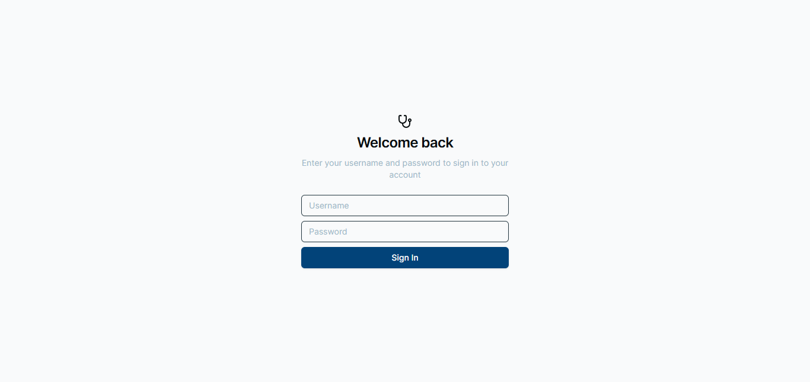
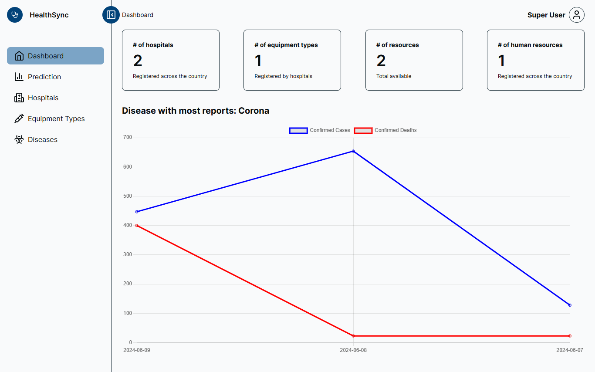
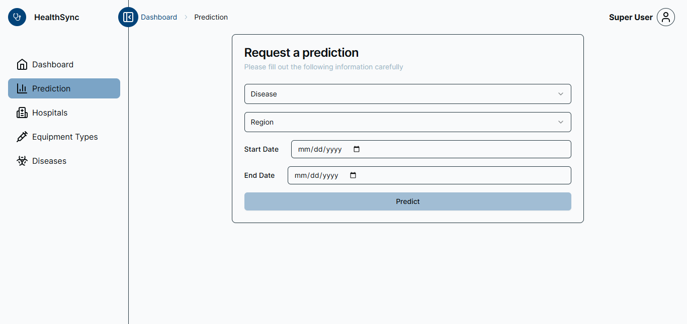
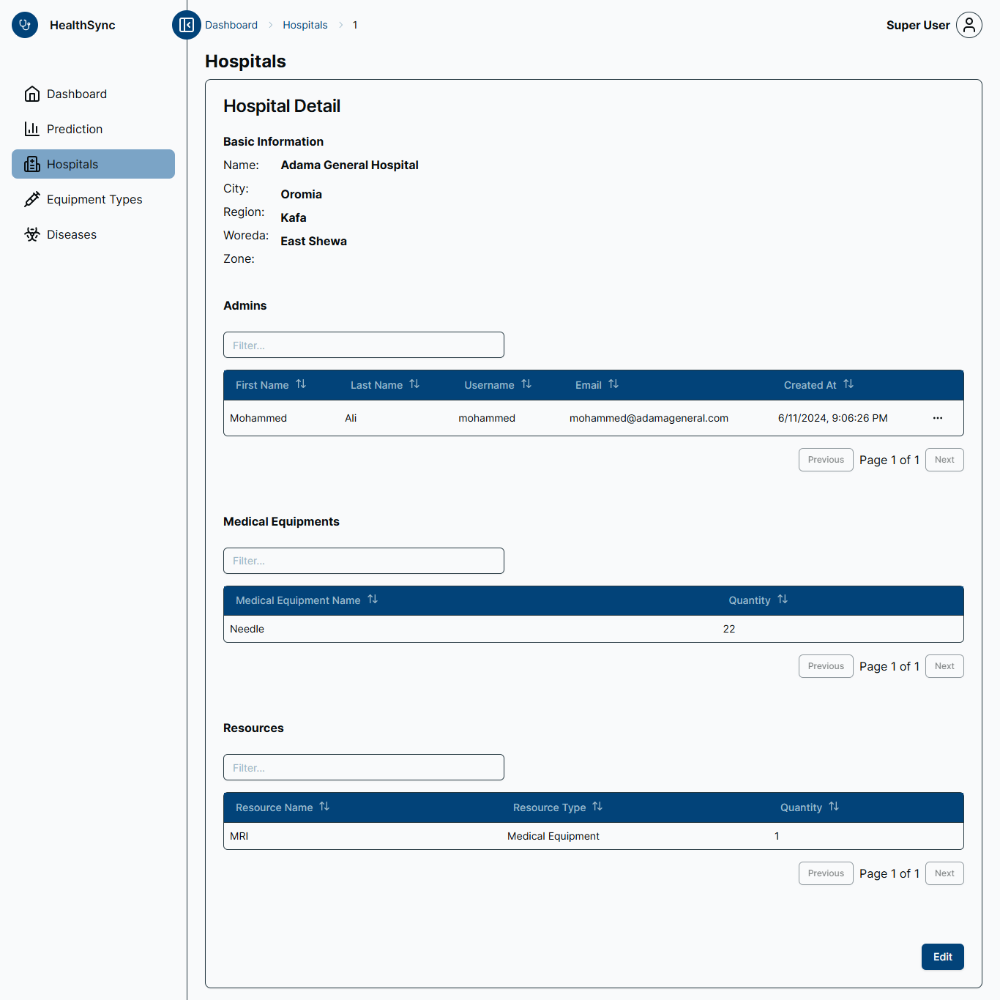
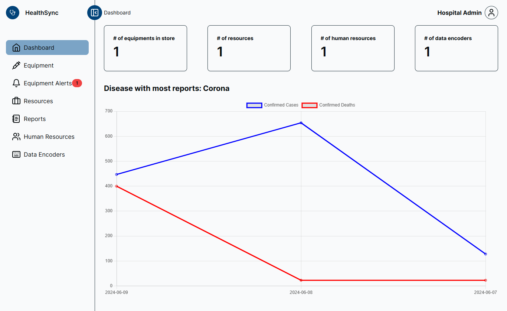

# Pandemic Resource Management System

A web-based platform designed to optimize resource distribution, track disease data, and predict trends among Ethiopian public hospitals during pandemics. This system enables hospitals and government administrators to efficiently share resources, monitor inventory levels, and gather accurate disease statistics for better decision-making during critical times.

---

## Table of Contents

- [Overview](#overview)  
- [Features](#features)  
- [Installation](#installation)  
- [Usage](#usage)  
- [Screenshots](#screenshots)  
- [Technologies Used](#technologies-used)  
- [License](#license)

---

## Overview

Managing resources effectively during pandemics can save lives. This system facilitates resource sharing across government-managed hospitals in Ethiopia, tracks disease cases in real-time, and predicts future trends based on collected data. By centralizing critical information, this system empowers decision-makers with accurate data to handle crises more efficiently.

---

## Features

### **For Super Administrators (Government):**
- **Dashboard Overview**:  
  Displays statistics on confirmed cases, registered hospitals, resource types, total resources, and human resources.  
- **Prediction Requests**:  
  Request predictions for disease trends by entering a date range.  
- **Hospital Management**:  
  View and manage a list of registered hospitals.  

### **For Hospital Administrators:**
- **Resource Management**:  
  Manage inventory, track alerts for low supplies, and report resource levels.  
- **Case Tracking**:  
  Input daily case numbers for diseases and generate hospital-specific reports.  
- **Alerts**:  
  Receive notifications when resource thresholds fall below minimum levels.  

### **Hospital Details**:
- View detailed information about each hospital, including administrators, medical equipment, and available resources.

### **Data Prediction**:  
Utilize collected data to forecast disease trends, helping authorities plan for potential surges or declines in cases.

---

## Installation

To set up the project locally, follow these steps:

1. Clone the repository:  
   ```bash
   git clone https://github.com/mohaali482/healthsync.git
   cd healthsync
   ```

2. Install dependencies using PNPM:  
   ```bash
   pnpm install
   ```

3. Set up environment variables:  
   - Copy the `.env.example` file:  
     ```bash
     cp .env.example .env
     ```
   - Edit the `.env` file with your database and application configurations.

4. Create the first supervisor:  
   Run the following command to seed the database and generate the first supervisor:  
   ```bash
   pnpm prisma db seed
   ```

5. Start the development server:  
   ```bash
   pnpm build && pnpm start
   ```

6. Open the application at [http://localhost:3000](http://localhost:3000).

---

## Usage

1. Log in as a government official or hospital administrator.  
2. Navigate to the dashboard to view statistics.  
3. Use the resource management tools to update inventory and track alerts.  
4. Enter daily disease cases for data gathering and trend predictions.  

---

## Screenshots

### Login Screen  


### Super Administrator Dashboard  


### Prediction Request Page  


### Hospital Management Page  


### Hospital Administrator Dashboard  


---

## Technologies Used

- **Frontend**: Next.js, TypeScript  
- **Backend**: Node.js  
- **Database**: PostgreSQL
- **Styling**: Tailwind CSS

---

## License

This project is licensed under the MIT License. See the `LICENSE` file for more details.